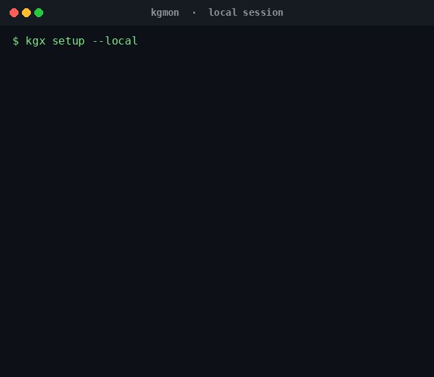
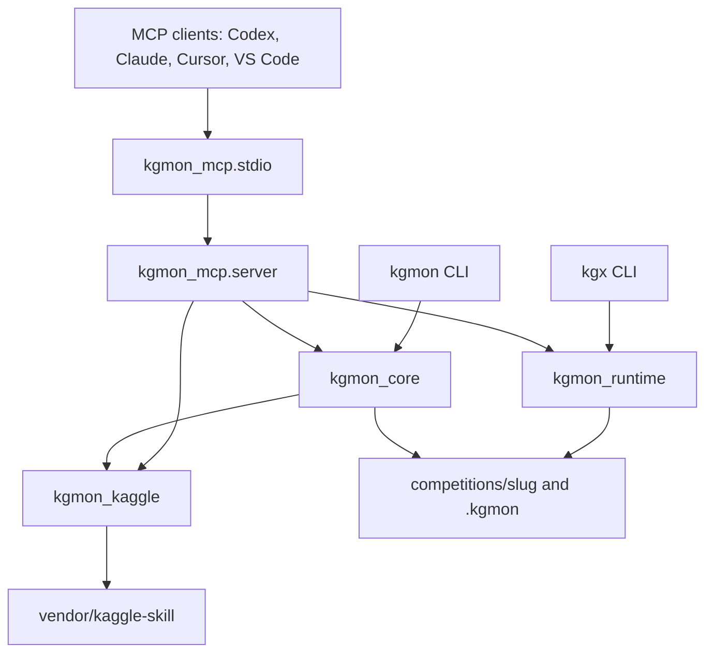

# kgmon

An MCP server and pair of CLIs that turn a Kaggle competition into a local, validation-first workspace, and keep final submission behind an explicit confirmation.

## What it does

`kgmon` builds and runs a competition workspace: rules, data profile, validation folds, baseline experiments, an ensemble submission, and a final package. `kgx` is the runtime launcher for local state, DS/ML skill and prompt packs, verification, and MCP client config. MCP hosts talk to the stdio server at `python -m kgmon_mcp.stdio` (also installed as `kgmon-mcp`).

Kaggle downloads, notebooks, and submissions go through `kgmon_kaggle`, which expects the vendored [`shepsci/kaggle-skill`](https://github.com/shepsci/kaggle-skill) checkout under `vendor/kaggle-skill`.

## Why

Competition files, reports, and run lineage stay in the workspace instead of only in a chat transcript. Leakage checks can block validation, diagnostics redact secrets, and `KGMON_SECURITY=strict` limits paths and refuses automatic submission. You confirm a final submit yourself.

## Demo



Recorded from a local session of `kgx setup --local`, `kgx doctor`, `kgx skills list --domain dsml`, and `kgmon kaggle doctor`. No Kaggle API token was set, so credentials report as missing. The `vendor/kaggle-skill` directory was present, so the doctor reported it as available.

## Architecture



`kgmon_mcp.server` exposes underscore tool names such as `kgmon_doctor` and `kgmon_verify_all`, plus `kgmon://` resources and DS/ML prompts. `kgmon_runtime` stores state, HUD, hooks, and verification evidence under `.kgmon/`. `kgmon_core` writes the competition tree under `competitions/<slug>/`.

## Features

- Stdio MCP server with stable JSON result envelopes, resources, and prompts
- Client config helpers for Codex, Claude, Cursor, and VS Code
- Competition workspace bootstrap and SQLite artifact registry
- Rules and metric parsing from captured Kaggle pages
- Data profiling and validation plans, including a leakage guard that can block experiments
- Baseline experiment specs, a dummy trainer, and DAG runs with local run lineage
- Ensemble submission from test predictions, plus a final package (`submission.csv`, `inference.py`, `solution.ipynb`, environment files, provenance, and a report)
- Guarded Kaggle notebook and submission commands
- Runtime modes: `deep-interview`, `ralplan`, `team`, `ralph`, `ultrawork`, and `autopilot`
- DS/ML skill, prompt, and checklist packs with a validation-first order
- Secret redaction in diagnostics and logs

## Install

Requires Python 3.11 or newer and Git.

```bash
git clone --recurse-submodules https://github.com/azxav/kgmon.git
cd kgmon
python -m venv .venv
source .venv/bin/activate
python -m pip install -e ".[dev]"
kgx setup --local
kgx doctor
```

If the clone did not fetch submodules:

```bash
git submodule update --init --recursive
```

On Windows PowerShell, activate the virtual environment with `.\.venv\Scripts\Activate.ps1`.

`pip install -e .` is enough if you do not want pytest, Ruff, or mypy. The editable install provides `kgx`, `kgmon`, and `kgmon-mcp`.

## Add it to an MCP client

From the repository root, after the package is installed:

```bash
kgx mcp install --client codex
kgx mcp doctor --client codex
```

`--client` accepts `codex`, `claude`, `cursor`, or `vscode`. Codex, Claude, and Cursor configs are written to `.mcp.json`. VS Code config is written to `.vscode/mcp.json`. Restart the client after the file changes.

`kgx mcp install` sets `KGMON_HOME` to the absolute repository path. A hand-written server entry looks like this:

```json
{
  "mcpServers": {
    "kgmon": {
      "command": "python",
      "args": ["-m", "kgmon_mcp.stdio"],
      "env": {
        "KGMON_HOME": "/absolute/path/to/kgmon",
        "KGMON_SECURITY": "strict"
      }
    }
  }
}
```

VS Code uses a `servers` object and `"type": "stdio"` instead of `mcpServers`. `kgx mcp install --client vscode` writes that shape for you.

The checked-in `.mcp.json` and `.vscode/mcp.json` point `KGMON_HOME` at `.` so they are not tied to one machine. Run `kgx mcp install` before relying on them in a client that does not start with the repository as its working directory.

`guide.md` has a longer Codex plugin walkthrough.

Public MCP tools:

- `kgmon_artifacts_list`
- `kgmon_bootstrap_competition`
- `kgmon_competition_audit_rules`
- `kgmon_data_profile`
- `kgmon_doctor`
- `kgmon_ensemble_search`
- `kgmon_experiment_plan`
- `kgmon_experiment_run`
- `kgmon_experiment_status`
- `kgmon_hud_get`
- `kgmon_kaggle_doctor`
- `kgmon_leakage_audit`
- `kgmon_package_final`
- `kgmon_prompt_run`
- `kgmon_prompts_list`
- `kgmon_skills_list`
- `kgmon_status_get`
- `kgmon_validation_plan`
- `kgmon_verify_all`

Resources include `kgmon://state/current`, `kgmon://mission/current`, `kgmon://hud/current`, `kgmon://logs/events`, and the `kgmon://competition/current/*` documents for the manifest, profile, validation, runs, artifacts, and final package.

## Configuration

kgmon reads process environment variables. Names are listed in `.env.example`; export them in the shell that launches the CLI or MCP server.

| Variable | Role |
| --- | --- |
| `KAGGLE_API_TOKEN` | Preferred Kaggle credential. |
| `KAGGLE_USERNAME` and `KAGGLE_KEY` | Legacy credential pair. Both must be set. |
| `KGMON_HOME` | Workspace root used by the MCP server when it is not started inside the repo. |
| `KGMON_SECURITY` | Set to `strict` for path allowlisting, security logs, and guarded submission behavior. |
| `KGMON_STATE_ROOT` | State directory override. Defaults to `.kgmon` inside the workspace. |
| `OPENAI_API_KEY`, `WANDB_API_KEY`, `HF_TOKEN` | Not required. Diagnostics redact them when they are present. |

A token file at `~/.kaggle/access_token` is also detected by `kgmon kaggle doctor`. Doctor output shows redacted values, not the raw secret.

## Examples

Health check:

```bash
kgx setup --local
kgx doctor
kgx doctor conflicts
kgmon kaggle doctor
```

DS/ML pack:

```bash
kgx skills list --domain dsml
kgx skills inspect kgmon-validation-leakage-auditor
kgx prompt run validation-design
kgx team --domain dsml
```

Ask an MCP client:

```text
Use the kgmon MCP server to run kgmon_doctor.
```

Competition workspace. Bootstrap, notebook, and submit commands call Kaggle. Replace `titanic` with the competition slug you are working on.

```bash
kgmon competition bootstrap titanic
kgmon competition audit-rules --workspace competitions/titanic
kgmon data profile --workspace competitions/titanic
kgmon validation plan --workspace competitions/titanic
kgmon experiment plan --mode baseline --workspace competitions/titanic
kgmon experiment run --all --workspace competitions/titanic
kgmon ensemble search --workspace competitions/titanic
kgmon package final --workspace competitions/titanic
kgmon submit --final --require-confirmation --confirm --workspace competitions/titanic
```

Runtime modes and verification:

```bash
kgx deep-interview titanic
kgx ralplan titanic
kgx verify all
kgx hud
kgx replay latest
KGMON_SECURITY=strict kgx doctor
```

`kgmon --help` and `kgx --help` list every command.

## Development

```bash
make lint
make test
```

`make typecheck` runs mypy. GitHub Actions runs Ruff and pytest on pull requests and pushes to `main`.

Milestone notes that used to live in this file are in [CHANGELOG.md](CHANGELOG.md).
